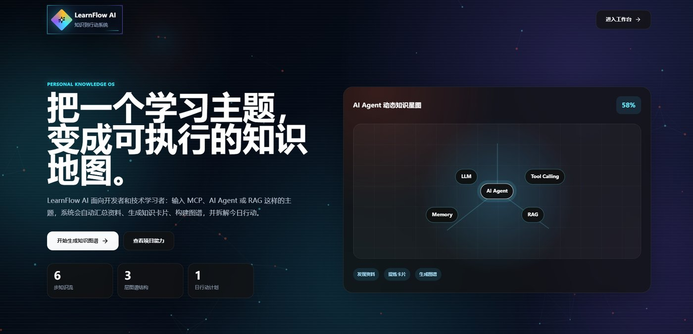
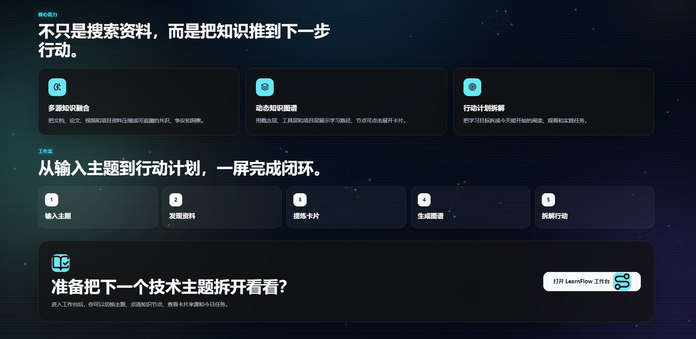
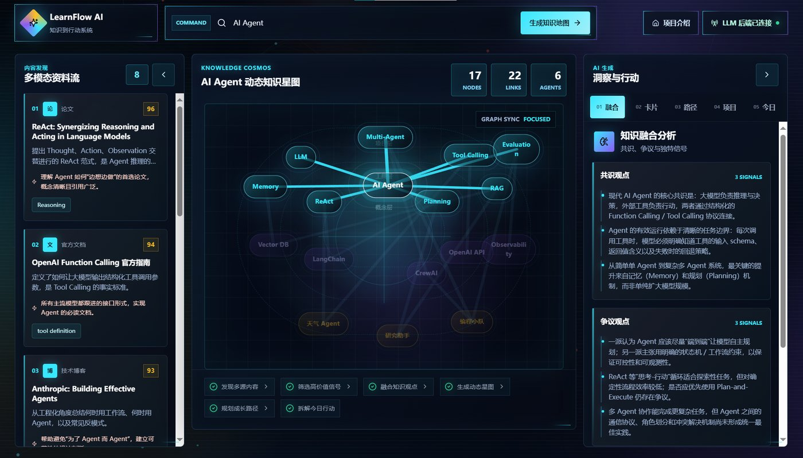
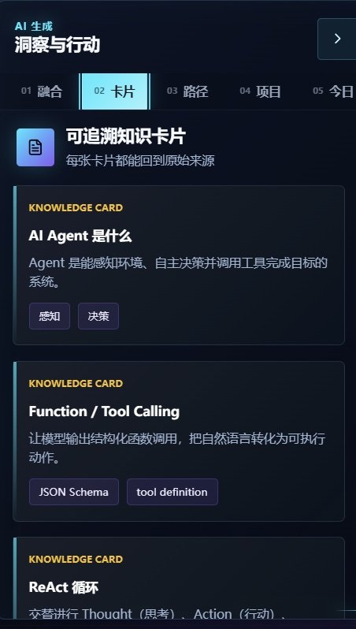
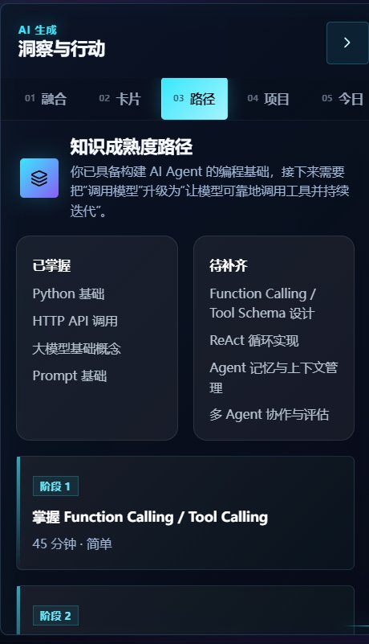
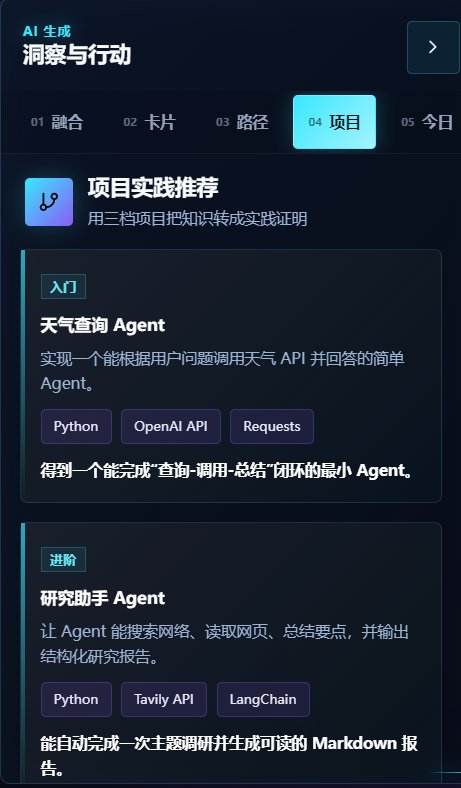
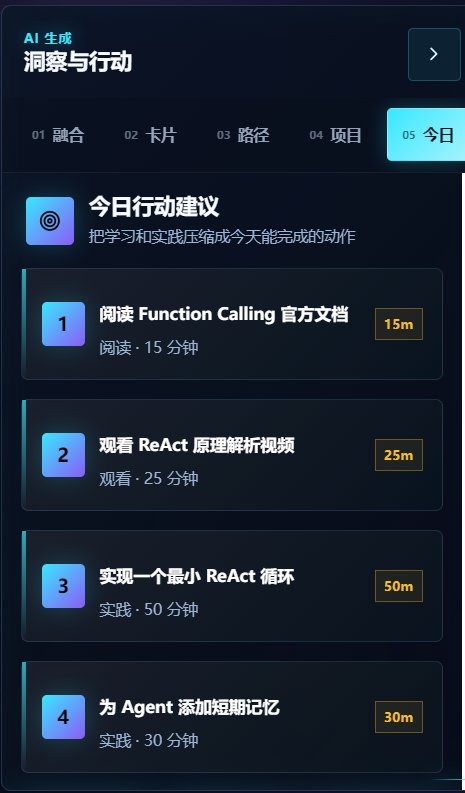
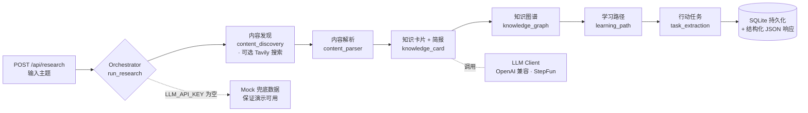

<div align="center">

# 🧭 LearnFlow AI

**把一个学习主题，变成可执行的知识地图**

面向开发者与技术学习者的 AI 知识行动平台 —— 输入一个主题（如「我要学 MCP」），
自动汇总资料、提炼知识卡片、构建知识图谱、规划学习路径，并拆解成今日就能开始的行动。


</div>



---

## 🏆 获奖

> 🥈 **阶跃星辰 Agent Builder Hackathon · 深圳站 · 二等奖**（2025.06）

---

## 💡 它解决什么问题

学习一门新技术时，我们常被五件事困住：

- 📚 **信息过载** —— 文章、视频、GitHub、文档散落在不同平台
- 🔍 **质量筛选难** —— 要花大量时间判断哪些值得读
- 🧩 **学用脱节** —— 看完资料，没有沉淀成自己的知识体系
- 💤 **行动转化低** —— 收藏很多，真正动手的很少
- 🗓️ **计划难落地** —— 缺少从知识到任务、从任务到日程的自动转化

LearnFlow 通过 **AI Agent 编排**，把「找资料 → 读资料 → 整理知识 → 生成任务 → 安排计划」串成一条自动化链路。

> 💬 我们解决的不是「收藏更多内容」，而是「把内容转化成可执行的成长路径」。
> 传统工具停在信息管理，我们再往前走一步 —— **把知识变成计划，把计划变成行动**。

### 👥 为谁而做

| 用户 | 典型场景 | 核心痛点 |
| --- | --- | --- |
| 👨‍💻 开发者 | 学习新技术、调研框架、做项目实践 | 信息源分散，学完不知如何实践 |
| 🔭 技术爱好者 | 追踪 AI / Agent / MCP / 开源热点 | 收藏很多，缺少结构化沉淀 |
| ✍️ 内容创作者 | 写技术文章、做知识整理、输出教程 | 需要快速收集资料、提炼观点 |
| 🎓 学生 / 求职者 | 学技术栈、准备项目、整理学习路径 | 不知先学什么、怎么转成项目 |

### 🎯 产品定位

不是信息收藏夹，也不是单篇摘要工具，而是一个
**从「发现内容」→「形成知识」→「驱动行动」的闭环系统**。

---

## ✨ 核心能力

| | 能力 | 说明 |
|---|---|---|
| 🔗 | **多源知识融合** | 把文档、论文、视频、开源项目资料压缩成可追溯的共识、争议与洞察 |
| 🌐 | **动态知识图谱** | 用「概念层 / 工具层 / 项目层」可视化学习路径，节点可点击展开卡片 |
| 🎯 | **行动计划拆解** | 把学习目标拆成今天就能开始的阅读、观看与实践任务 |



---

## 🖥️ 产品界面

**三栏工作台**：左侧多模态资料流 · 中间动态知识星图 · 右侧 AI 生成的洞察与行动



**右侧「洞察与行动」面板的四个视图**：

| 🃏 知识卡片 | 🪜 学习路径 | 🚀 项目实践 | 📅 今日行动 |
|:---:|:---:|:---:|:---:|
|  |  |  |  |
| 每张卡片都能回到原始来源 | 已掌握 / 待补齐 + 分阶段路线 | 入门/进阶三档实践项目 | 把学习压缩成今天能完成的动作 |

---

## 🔄 工作流

```text
输入主题 / 链接 / RSS
  → 内容发现与抓取
  → AI 摘要与知识融合
  → 知识卡片与知识图谱
  → 学习路径与项目建议
  → 行动任务与日程计划
```

---

## 🏗️ 技术架构

后端采用**服务编排（orchestrator）模式**，把一次「研究」串成多个 agent 式步骤；
LLM 调用全程带 **mock 兜底**，无 API Key 也能完整演示。



前端是围绕 `Workspace` 数据模型构建的三栏单页应用，知识图谱由自研 SVG 分层图渲染（节点为可点击按钮 + SVG 连线层）。

---

## 🛠️ 技术栈

| 层级 | 技术 |
| --- | --- |
| 前端 | React 19 + Vite 7 + TypeScript 5.8 · 自研 SVG 知识图谱 · lucide-react |
| 后端 | Python FastAPI 0.111 + Pydantic 2 + SQLAlchemy 2（async）+ aiosqlite |
| AI | OpenAI 兼容 API（`httpx`，默认对接 StepFun 阶跃星辰；支持智谱 / 通义 / DeepSeek） |
| 数据库 | SQLite（`backend/hub.db`） |
| 测试 | Vitest + jsdom + Testing Library |
| 文档 | FastAPI Swagger（`/docs`） |

---

## 📂 项目结构

```text
LearnFlow/
├── backend/                    # FastAPI 后端（服务编排）
│   └── app/
│       ├── main.py             # 应用入口、CORS、静态托管
│       ├── routers/            # health / research / cards / tasks
│       ├── services/           # orchestrator + 6 个 agent 式模块
│       │   ├── orchestrator.py        # 串联整条研究流水线
│       │   ├── llm_client.py          # OpenAI 兼容客户端（失败即兜底）
│       │   ├── content_discovery.py   # 资料发现（可选 Tavily）
│       │   ├── content_parser.py      # 内容解析
│       │   ├── knowledge_card.py      # 知识卡片
│       │   ├── knowledge_graph.py     # 知识图谱
│       │   ├── learning_path.py       # 学习路径
│       │   └── task_extraction.py     # 行动任务
│       ├── models/             # 异步 SQLAlchemy 数据模型
│       ├── schemas/            # Pydantic 请求/响应模型
│       └── data/               # 关键词 mock 兜底数据
├── frontend/                   # React 19 + Vite 工作台 UI
│   └── src/
│       ├── App.tsx             # 顶层状态与三栏布局
│       ├── components/         # KnowledgeGraph / InsightPanel / SourcePanel
│       └── lib/                # Workspace 数据模型与图谱工具
├── docs/images/                # README 展示图
├── PRD-个人知识与效率协作中枢.md  # 产品需求与接口契约
└── CLAUDE.md                   # 架构与开发说明
```

---

## 🚀 快速开始

<details>
<summary>展开查看本地运行步骤</summary>

**环境要求**：Python 3.10+ · Node.js 18+

### 1. 启动后端

```bash
cd backend
python -m venv .venv
# Windows: .venv\Scripts\activate    |    macOS/Linux: source .venv/bin/activate
pip install -r requirements.txt
cp .env.example .env          # 不填 LLM_API_KEY 则自动使用 mock 数据
uvicorn app.main:app --reload --port 8000
```

Swagger 文档：http://localhost:8000/docs

### 2. 启动前端

```bash
cd frontend
npm install
npm run dev          # http://127.0.0.1:5173
```

> 未配置 `LLM_API_KEY` 时，后端自动返回基于关键词的 mock 数据，保证演示随时可跑。

</details>

---

## 📡 API 概览

| 方法 | 路径 | 说明 |
| --- | --- | --- |
| `GET` | `/api/health` | 健康检查 |
| `POST` | `/api/research` | 主题研究（核心接口） |
| `GET` | `/api/research/history` | 最近研究记录 |
| `POST` | `/api/cards/{id}/favorite` | 收藏知识卡片 |
| `PATCH` | `/api/tasks/{id}` | 更新任务状态（`todo` / `doing` / `done`） |

详细产品需求见 [`PRD-个人知识与效率协作中枢.md`](./PRD-个人知识与效率协作中枢.md)，架构与接口契约见 [`CLAUDE.md`](./CLAUDE.md)。

---

## 🗺️ 后续迭代方向

- 🔌 接入 RSSHub / Firecrawl / GitHub Trending / HackerNews 等真实多源
- 🧠 引入向量数据库，支持个人知识库语义搜索与真正的知识图谱关系追踪
- 🌐 浏览器插件：一键保存网页、PDF、视频
- 📆 接入飞书 / Google Calendar / Notion，让「今日计划」真正进日历
- 🧑‍🏫 成长教练：每日推荐 + 每周复盘，根据学习行为个性化推荐

> 当前为黑客松 MVP：**4 小时内**完成可演示 Web Demo —— 前端完整工作台 + 后端可调用 API + LLM 失败自动兜底，保证现场演示不中断。

---

## 📄 License

MIT
